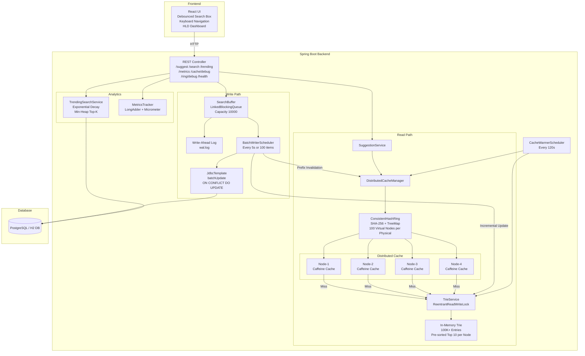
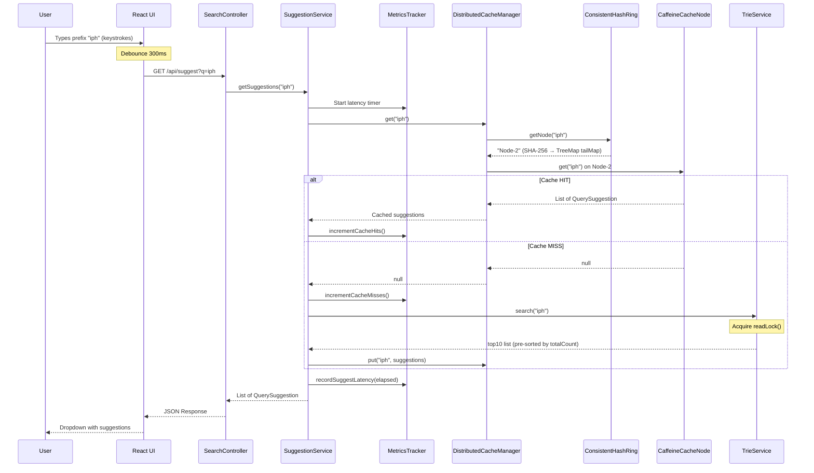
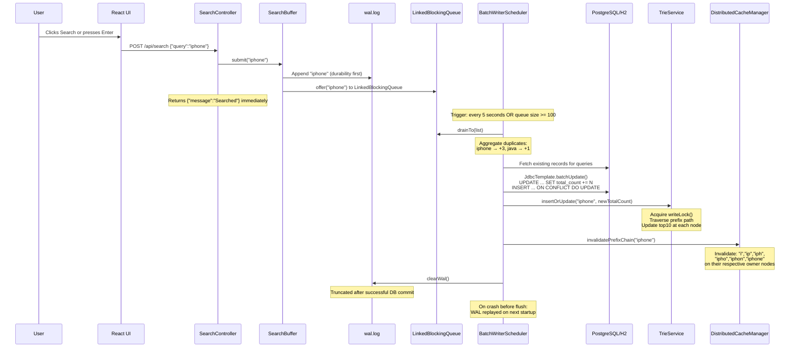
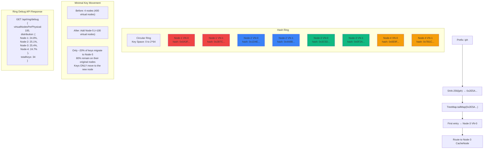

# Search Typeahead System — Architecture Diagrams

This document contains all 4 Mermaid diagrams requested: System Architecture, Sequence Diagram (Read Flow), Batch Write Flow, and Consistent Hashing Flow.

---

## 1. System Architecture (Component Diagram)

---

## 2. Sequence Diagram — Read Flow (GET /suggest)

---

## 3. Batch Write Flow (POST /search)

---

## 4. Consistent Hashing Flow

