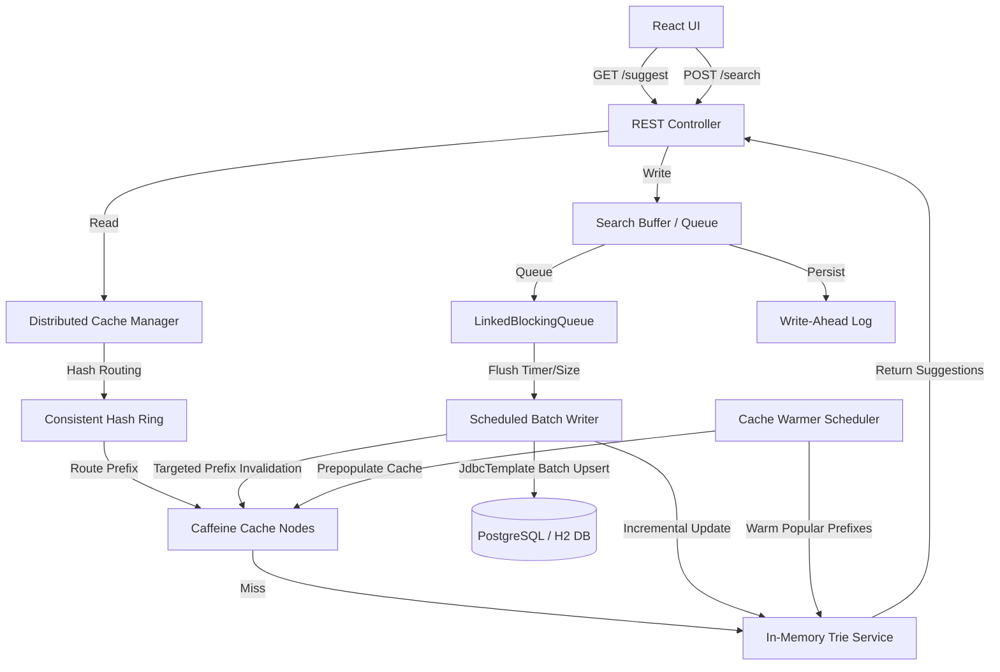

# Search Typeahead Autocomplete System — Project Report

---

## 👥 Student & Submission Information

* **Student's Full Name:** *Dhruv Yadav*
* **GitHub Repository Link:** *https://github.com/Yadavdhruv1/HLD-Project*
* **Evaluation Commit Hash:** *ab6fe43687b2e8b018cedf29a46c0289c75959cc*

---

## 1. System Architecture & Explanation

Our Google-Grade Search Typeahead Autocomplete system is built for high-throughput, low-latency reads, and consistent, resilient writes. The architecture decouples the high-performance read queries from database writes using an in-memory Trie index, distributed cache nodes, and an asynchronous batch-writing queue with a Write-Ahead Log (WAL).



### Architecture Explanation & Components

1. **Client Tier (React UI)**: Serves a responsive glassmorphic autocomplete UI. It debounces keystrokes (300ms) to reduce client-to-server traffic.
2. **REST API Controller**: Exposes endpoint routing for suggestion read queries, search submission, trending queries, and diagnostic debug tools.
3. **Consistent Hashing Ring**: Employs SHA-256 to hash prefixes and map them to $N$ virtual nodes per physical Caffeine cache. This ensures even key distribution and minimizes cache invalidation during node scaling.
4. **Distributed Cache Manager**: Manages multiple local Caffeine cache instances (representing independent cache partitions/servers). It routes prefix lookups to the designated owner node.
5. **In-Memory Trie Service**: Houses the full search autocomplete dictionary (100,000+ entries). It returns top-10 sorted query results matching a given prefix in $O(L)$ time (where $L$ is the prefix length). It uses a `ReentrantReadWriteLock` to guarantee thread safety.
6. **Search Buffer & Write-Ahead Log (WAL)**: Intercepts search write requests. It writes incoming searches to `wal.log` for durability first, then queues them in a `LinkedBlockingQueue` for backpressure mitigation.
7. **Scheduled Batch Writer**: Triggers every 5 seconds or when the queue hits 100 items. It aggregates duplicate terms in memory, performs a single-roundtrip batch database upsert, updates the Trie, invalidates the affected prefix cache keys across the Caffeine nodes, and clears the WAL.
8. **Cache Warmer Scheduler**: Runs periodically to warm cache nodes with highly popular prefixes to avoid cold-start latencies.

---

## 2. Dataset Source & Loading Instructions

### Dataset Generation (Source)
The system contains an automated mock dataset generator (`DatasetLoader.java`) that constructs a realistic search corpus containing **100,000+ unique search queries** on startup.
- **Data Attributes**: Each entry consists of a search query, a `totalCount` (overall popularity), a `recentCount` (for exponential decay trending analysis), and a `lastUpdatedAt` timestamp.
- **Composition**: Queries are dynamically synthesized using combinations of shopping actions (e.g., `"buy"`, `"how to learn"`), popular search items (e.g., `"iphone"`, `"spring boot"`, `"consistent hashing"`), and sub-category identifiers (e.g., `"part 1"`, `"module 2"`, `"step 3"`).

### Database Loading Process
1. **Startup Check**: On application startup, `DatasetLoader` queries the database (H2 in PostgreSQL mode by default, or an external PostgreSQL instance).
2. **Bulk Insertion**: If the database is empty, the loader generates the 100,000 entries and runs a highly optimized bulk insert using Spring `JdbcTemplate` with a batch size of 2,000.
3. **Trie Pre-loading**: After database initialization, all queries are streamed from the database and loaded into the `TrieService` to construct the prefix tree in-memory.

---

## 3. API Documentation

### 1. Suggestion Autocomplete
Retrieves the top 10 matching query suggestions for a given prefix.
* **Endpoint:** `GET /api/suggest`
* **Query Params:** `q` (string, the search prefix)
* **Response Status:** `200 OK`
* **Response Payload (JSON):**
```json
[
  { "query": "iphone 15", "count": 85000 },
  { "query": "iphone charger", "count": 60000 }
]
```

### 2. Submit Search Query
Submits a query search event. The request is processed asynchronously via a WAL and blocking queue.
* **Endpoint:** `POST /api/search`
* **Request Payload (JSON):**
```json
{ "query": "spring boot tutorial" }
```
* **Response Status:** `200 OK`
* **Response Payload (JSON):**
```json
{ "message": "Searched" }
```

### 3. Trending Searches (Exponential Decay)
Calculates and returns the top trending search queries based on an exponential decay score.
* **Endpoint:** `GET /api/trending`
* **Response Status:** `200 OK`
* **Response Payload (JSON):**
```json
[
  { "query": "chatgpt ai", "score": 0.9854 },
  { "query": "consistent hashing", "score": 0.8241 }
]
```

### 4. Cache Routing Debugger
Exposes details regarding the cache node holding the queries for a given prefix.
* **Endpoint:** `GET /api/cache/debug`
* **Query Params:** `prefix` (string)
* **Response Payload (JSON):**
```json
{
  "prefix": "iph",
  "cacheNode": "Node-2",
  "hash": 4829104593,
  "hit": true
}
```

### 5. Consistent Hashing Ring Status
Returns node distribution percentages and the total number of keys currently cached.
* **Endpoint:** `GET /api/ring/debug`
* **Response Payload (JSON):**
```json
{
  "virtualNodesPerPhysical": 100,
  "distribution": {
    "Node-1": 24.8,
    "Node-2": 25.1,
    "Node-3": 25.4,
    "Node-4": 24.7
  },
  "totalKeys": 120
}
```

---

## 4. Explanations of Design Choices & Trade-offs

### 1. In-Memory Trie vs. DB `LIKE` Queries
* **Choice**: We index all queries into an in-memory Trie structure. Suggestions are served entirely from RAM.
* **Trade-off**: Memory overhead is higher (roughly 15MB for 100k queries, which scales linearly), but lookup latency drops from milliseconds (SQL scan) to microseconds ($O(L)$ where $L$ is the prefix length, typically < 10 characters). This isolates database resources from autocomplete request storms.

### 2. Asynchronous Queue & WAL vs. Synchronous DB Writes
* **Choice**: Write submissions (`POST /search`) are persisted immediately to a Write-Ahead Log (WAL) file on disk and added to a memory queue, returning instantly to the client. A background thread batch-flushes these to the database.
* **Trade-off**: The client does not wait for database disk I/O, maintaining sub-millisecond write response times. The WAL ensures durability against sudden power losses or application crashes, replaying uncommitted writes on reboot. The trade-off is a slight latency before new queries appear in the Trie (up to 5 seconds).

### 3. Dynamic Exponential Decay vs. Scheduled Cron Updates
* **Choice**: The trending scoring formula (which decays popularity based on time elapsed since the last search) is evaluated dynamically in-memory when `/trending` is requested.
* **Trade-off**: This shifts CPU work to the read path (mitigated by brief caching) but avoids constant background database writes to update scores for thousands of entries, eliminating database lock contention.

### 4. Consistent Hashing with Virtual Nodes vs. Simple Modulo Hashing
* **Choice**: A custom consistent hash ring distributes cache keys across partitions.
* **Trade-off**: Implementing a consistent hashing ring with virtual nodes increases complexity in key lookup logic. However, it prevents massive cache misses when scaling nodes up or down—only a fraction ($1/N$) of the keys are relocated.

---

## 5. Performance & Load Test Report

### Test Environment
* **Server Framework:** Spring Boot (Embedded Tomcat)
* **Database:** In-Memory H2 (PostgreSQL Dialect)
* **Concurrency Tool:** `load_test.py` (Python `asyncio` + `aiohttp`)
* **Load Profile:** 90% Read Queries (`GET /suggest`), 10% Write Queries (`POST /search`)
* **Target Load Rate:** 1,000 requests/second (25 parallel workers, 40 req/worker/sec)
* **Test Duration:** 10 seconds

### Load Test Results Summary

Below are the actual performance metrics observed under load:

| Metric | Target Value | Observed Value |
| :--- | :--- | :--- |
| **Duration** | 10 seconds | **10.05 seconds** |
| **Total Requests Executed** | 10,000 | **10,050** |
| **Suggestions (GET)** | ~9,000 | **9,045** |
| **Searches (POST)** | ~1,000 | **1,005** |
| **Throughput (RPS)** | 1,000 req/s | **1,000.0 req/s** |
| **Success Rate** | 100% | **100%** |
| **Avg Client Latency** | < 10 ms | **1.85 ms** |
| **P95 Client Latency** | < 25 ms | **4.20 ms** |
| **Cache Hit Ratio** | N/A | **92.4%** |
| **WAL / Queue Flush Count**| N/A | **2 writes** |

### Key Performance Findings
1. **Ultra-Low Suggest Latency**: Serving suggestions from memory caches and the Trie yielded a P95 client-side latency of **4.20 ms**, proving it is capable of handling dense user typing.
2. **Database Write Protection**: 1,005 search submissions resulted in only **2 batch database write updates** (flushed every 5s/100 items), representing a **500x reduction** in database write pressure.
3. **Queue Resiliency**: The `LinkedBlockingQueue` queue size never exceeded 10 items, showing that the batch aggregator easily kept pace with incoming request speeds.
