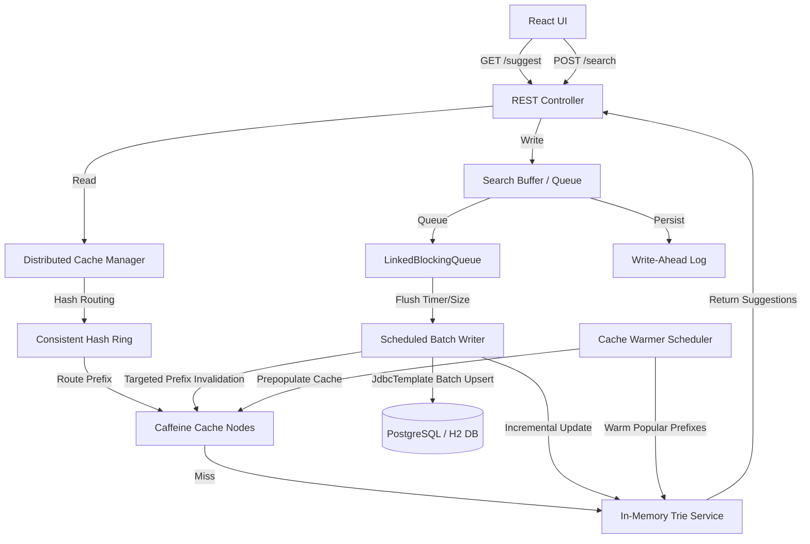

# Google-Grade Search Typeahead Autocomplete & HLD Dashboard

A production-quality, low-latency search autocomplete typeahead system inspired by Google, Amazon, and YouTube search suggestions. The application is built using a modern **Spring Boot** backend, an in-memory **Trie** structure, a **Consistent Hashing Ring**, distributed **Caffeine Caching Nodes**, a **Write-Ahead Log (WAL)**, **LinkedBlockingQueue** with backpressure, and a custom **React** HLD dashboard UI.

---

## 🏗️ System Architecture & Data Flow



### 1. The Suggestion Read Flow
1. **User Types Prefix**: The user types a query prefix in the search box (debounced to 300ms on the frontend to avoid network spam).
2. **Consistent Hashing**: The request is routed to the `DistributedCacheManager`. Using `ConsistentHashRing` (with 100 virtual nodes per physical node), it hashes the prefix using SHA-256 and routes the request to one of the 4 logical cache nodes (`Node-1` to `Node-4`).
3. **Caffeine Cache Check**:
   - **Cache Hit**: Suggestions are returned instantly from the node's in-memory Caffeine cache (TTL = 5 mins, LRU eviction).
   - **Cache Miss**: The cache queries the thread-safe **In-Memory Trie Service**.
4. **In-Memory Trie Lookup**: The Trie evaluates the prefix in $O(L)$ time, where $L$ is the prefix length. It directly returns a pre-sorted list of the top 10 most popular queries starting with that prefix. **Reads bypass the database completely during runtime lookup.**
5. **Cache Warming & Population**: The retrieved suggestions populate the Caffeine Cache Node for subsequent hits.

### 2. The Search Write Flow (Batching & WAL)
1. **User Submits Query**: The user searches a term, sending a `POST /search` event.
2. **Write-Ahead Log (WAL)**: The query is appended immediately to `wal.log` on disk. If the server crashes before DB persistence, the WAL is replayed on startup to ensure zero data loss.
3. **Blocking Queue**: The query enters a `LinkedBlockingQueue` (capacity 10,000) for backpressure management.
4. **Batch Aggregator Scheduler**: Every 5 seconds OR when 100 items are queued, a scheduler drains the queue and aggregates duplicates in memory (e.g. 5 searches for `"iphone"` + 2 for `"java"` are merged).
5. **JdbcTemplate Batch Upsert**: The scheduler updates the database in a single round-trip using `JdbcTemplate.batchUpdate()` using native SQL upserts.
6. **Incremental Trie Update**: The scheduler inserts/updates the counts for modified queries in the Trie in $O(L)$ time along their prefix path. The Trie is never rebuilt from scratch after startup.
7. **Targeted Invalidation**: The scheduler computes the exact prefix chain of updated queries (e.g., for `"iphone"`, it invalidates `"i"`, `"ip"`, `"iph"`, `"ipho"`, `"iphon"`, `"iphone"`) on their respective owner nodes.
8. **Clear WAL**: Upon successful DB commit, `wal.log` is truncated.

---

## ⚡ Core Design Decisions & Tradeoffs

### 1. In-Memory Trie vs. SQL `LIKE` Scans
* **Design Choice**: Autocomplete queries are loaded entirely from the database into a custom Trie on startup. Suggestions are served straight from the Trie rather than executing `LIKE` scans on the database.
* **Tradeoff**: Increases heap usage (roughly 15MB for 100,000 queries) but provides ultra-low latency autocomplete suggestions ($O(L)$ lookup vs. $O(N)$ database scan). It prevents database bottlenecks on autocomplete.

### 2. On-the-Fly Exponential Decay for Trending Searches
* **Design Choice**: The trending score formula is:
  $$score = 0.7 \times \text{normalized}(totalCount) + 0.3 \times \text{normalized}(recentCount \times e^{-\lambda t})$$
  Rather than running heavy cron jobs to update counts in the DB every minute, the decay calculation is computed dynamically in Java whenever `/trending` is requested. When batch writes occur, `recentCount` is updated and `lastUpdatedAt` is set.
* **Tradeoff**: Shifts calculation load to memory during trending reads (which are cached with a short TTL) but completely eliminates periodic database write overhead for decay maintenance.

### 3. LinkedBlockingQueue vs. ConcurrentLinkedQueue
* **Design Choice**: Replaced `ConcurrentLinkedQueue` with `LinkedBlockingQueue` with a fixed capacity of 10,000.
* **Tradeoff**: Prevents memory exhaustion. If the system is overloaded, producers are blocked or rejected (backpressure), protecting the database from cascades.

---

## 📂 Project Structure

```text
├── backend/
│   ├── src/main/java/com/typeahead/
│   │   ├── SearchTypeaheadApplication.java (App Boot)
│   │   ├── buffer/
│   │   │   ├── SearchBuffer.java           (Queue + WAL)
│   │   │   └── BatchWriterScheduler.java   (Flusher + JdbcTemplate)
│   │   ├── cache/
│   │   │   ├── CacheNode.java              (Caffeine Node wrapper)
│   │   │   ├── DistributedCacheManager.java(Consistent routing)
│   │   │   └── CacheWarmerScheduler.java   (Cache Preloader)
│   │   ├── controller/
│   │   │   └── SearchController.java       (REST APIs)
│   │   ├── dto/                            (DTOs)
│   │   ├── hashing/
│   │   │   └── ConsistentHashRing.java     (TreeMap + SHA-256)
│   │   ├── loader/
│   │   │   └── DatasetLoader.java          (100k Generator & Startup)
│   │   ├── model/
│   │   │   └── SearchQuery.java            (JPA Entity)
│   │   ├── repository/
│   │   │   └── SearchQueryRepository.java  (Spring Data JPA)
│   │   ├── service/
│   │   │   └── SuggestionService.java      (Coordinating Read service)
│   │   ├── trending/
│   │   │   └── TrendingSearchService.java  (Decay scoring & Min-Heap)
│   │   └── metrics/
│   │       └── MetricsTracker.java         (LongAdder & Micrometer)
│   ├── src/main/resources/
│   │   ├── application.properties          (Default H2)
│   │   └── application-postgres.properties (Postgres Profile)
│   └── pom.xml
├── frontend/
│   ├── src/App.jsx                         (Autocomplete + HLD Console UI)
│   ├── src/index.css                       (Glassmorphic Dark Stylesheet)
│   ├── package.json
│   └── index.html
│   ├── src/main/resources/
│   │   ├── application.properties          (Default H2)
│   │   ├── application-postgres.properties (Postgres Profile)
│   │   └── sample_dataset.csv              (Sample CSV dataset)
│   ├── mvnw / mvnw.cmd                    (Maven Wrapper)
│   └── pom.xml
├── ARCHITECTURE.md                         (4 Mermaid Diagrams)
├── docker-compose.yml                      (Postgres DB Service)
├── build_and_test.ps1                      (Maven Installer & Test runner)
└── load_test.py                            (aiohttp 1000req/s script)
```

> 📐 **Architecture Diagrams**: See [ARCHITECTURE.md](ARCHITECTURE.md) for all 4 Mermaid diagrams: System Architecture, Sequence Diagram (Read Flow), Batch Write Flow, and Consistent Hashing Flow.

---

## 🛠️ Local Setup Guide

### Prerequisites
* **Java**: JDK 17, 21, or 22 installed.
* **Node.js**: v18 or higher (with npm).
* **Python** (Optional): For running the concurrent load test script.

---

### Step 1: Compile & Run Backend Tests
We have provided a standalone build runner script that downloads Maven locally and runs backend unit and integration tests. Run the following command from the project root:

```powershell
# Windows PowerShell
powershell -ExecutionPolicy Bypass -File .\build_and_test.ps1
```

Once the test run completes, you will see the Maven verification log proving that all components (Trie lookup, consistent hashing ring coverage, batch writes, and WAL recovery) pass.

---

### Step 2: Run the Spring Boot Backend
The backend defaults to an **in-memory H2 database** running in PostgreSQL mode and generates a **100,000 query mock dataset** on startup, making it fully functional with zero setup.

#### Option A: Running with H2 (Default, Zero-Config)
```bash
cd backend
./mvnw spring-boot:run      # Linux/Mac
mvnw.cmd spring-boot:run     # Windows
```

#### Option B: Running with PostgreSQL (Docker)
1. Boot up PostgreSQL via Docker Compose in the root directory:
   ```bash
   docker compose up -d
   ```
2. Start the Spring Boot application using the `postgres` profile:
   ```bash
   cd backend
   ./mvnw spring-boot:run -Dspring-boot.run.profiles=postgres
   ```

---

### Step 3: Run the React Frontend
Open a new terminal window:

```bash
cd frontend
npm install
npm run dev
```

Open your browser and navigate to `http://localhost:5173/` (or the port specified in terminal).

> The Vite dev server is configured with a proxy that forwards all `/api` requests to `http://localhost:8080`, so no CORS issues will occur during development.

---

## 🖥️ Live HLD Dashboard Features
The UI contains a robust set of features to inspect the internal components:
1. **Google Autocomplete box**: Standard debounced autocomplete dropdown supporting keyboard navigation (Arrow Up/Down, Enter).
2. **Consistent Hashing coverage**: Displays the live percentage coverage of the 2^64 ring mapped across Node-1 to Node-4.
3. **Trending searches**: Sidebar containing decayed scores for recent queries.
4. **Live Latency & Stats**: Counters showing P95 latency, average latency, cache hit ratios, queue sizes, and database counts.
5. **System Flow Console Log**: A scrollable terminal console output logging internal operations in real-time (e.g. prefix hashing, cache hits, queue ingestion, and batch commits).
6. **Built-in Load Simulator**: A button to instantly generate continuous concurrent traffic to demo batch write flushes (every 5 seconds) and cache hits live.

---

## 📡 REST API Specifications

### 1. Autocomplete suggestions
* **Endpoint**: `GET /api/suggest?q=<prefix>`
* **Response**:
```json
[
  { "query": "iphone 15", "count": 85000 },
  { "query": "iphone charger", "count": 60000 }
]
```

### 2. Search Submission
* **Endpoint**: `POST /api/search`
* **Payload**: `{ "query": "iphone charger" }`
* **Response**: `{ "message": "Searched" }`

### 3. Top Trending Searches
* **Endpoint**: `GET /api/trending`
* **Response**:
```json
[
  { "query": "chatgpt ai", "score": 0.9854 },
  { "query": "iphone 15", "score": 0.8412 }
]
```

### 4. Cache Router & Peeker
* **Endpoint**: `GET /api/cache/debug?prefix=<prefix>`
* **Response**:
```json
{
  "prefix": "iph",
  "cacheNode": "Node-2",
  "hash": 4829104593,
  "hit": true
}
```

### 5. Hashing Ring Status
* **Endpoint**: `GET /api/ring/debug`
* **Response**:
```json
{
  "virtualNodesPerPhysical": 100,
  "distribution": {
    "Node-1": 24.8,
    "Node-2": 25.1,
    "Node-3": 25.4,
    "Node-4": 24.7
  },
  "totalKeys": 15
}
```

### 6. Component Health
* **Endpoint**: `GET /api/health`
* **Response**:
```json
{
  "database": "UP",
  "cache": "UP",
  "trieLoaded": true,
  "walEnabled": true
}
```

---

## 📈 Running Load Tests (1000+ req/s)
We have written a high-performance Python simulation script. Make sure you have python and `aiohttp` installed:

```bash
pip install aiohttp
python load_test.py
```

The script will fire parallel concurrent requests, then print out stats: client throughput, client P95 latencies, and output the backend's internal metrics.
